# 🤖 RAG Agent - Intelligent Document Q&A System

<div align="center">

[](https://streamlit.io/)
[](https://python.org/)
[](https://supabase.com/)
[](https://ai.google/)

*An intelligent Retrieval-Augmented Generation system that enables users to upload documents and have natural conversations with their content using Google's Gemini AI.*

</div>

---

## ✨ Features

### 🔐 **Secure Authentication**
- User registration and login via Supabase Auth
- Session management with secure token handling
- Email verification for account security

### 📚 **Smart Document Processing**
- Support for multiple file formats: **PDF**, **TXT**, **DOCX**
- Intelligent text chunking and vectorization
- Per-user document isolation and management
- Real-time document upload and processing

### 💬 **Conversational AI Interface**
- Natural language querying of uploaded documents
- Context-aware responses using conversation history
- Multiple chat sessions per user
- Chat renaming and management capabilities
- Auto-save functionality

### 🔍 **Advanced Vector Search**
- Google Generative AI embeddings for semantic search
- Supabase vector store with pgvector extension
- Efficient similarity search and document retrieval
- User-specific filtering for data privacy

---

## 🏗️ Architecture

```mermaid
graph TB
    A[👤 User Interface<br/>Streamlit] --> B[🔐 Authentication<br/>Supabase Auth]
    A --> C[📄 Document Processor<br/>LangChain Loaders]
    C --> D[🧠 Vector Store<br/>Supabase + pgvector]
    D --> E[🔍 Retriever<br/>Semantic Search]
    E --> F[🤖 LLM Chain<br/>Google Gemini]
    F --> G[💬 Conversation Manager<br/>Chat History]
    G --> H[(🗄️ Database<br/>Supabase)]
    
    style A fill:#ff6b6b,stroke:#333,stroke-width:2px,color:#fff
    style B fill:#4ecdc4,stroke:#333,stroke-width:2px,color:#fff
    style D fill:#45b7d1,stroke:#333,stroke-width:2px,color:#fff
    style F fill:#96ceb4,stroke:#333,stroke-width:2px,color:#fff
    style H fill:#ffeaa7,stroke:#333,stroke-width:2px,color:#333
```



---

## 🚀 Quick Start

### Prerequisites

- Python 3.8+
- Supabase account and project
- Google AI API key

### 1️⃣ Clone Repository

```bash
git clone <repository-url>
cd rag-agent
```

### 2️⃣ Install Dependencies

```bash
pip install -r requirements.txt
```

### 3️⃣ Environment Setup

Create a `.env` file in the root directory:

```env
GOOGLE_API_KEY="your_google_ai_api_key"
SUPABASE_URL="your_supabase_project_url"
SUPABASE_KEY="your_supabase_anon_key"
```

### 4️⃣ Database Setup

Execute the provided SQL script in your Supabase SQL editor:

<details>
<summary>📋 Click to view database setup script</summary>

```sql
-- Enable pgvector extension
CREATE EXTENSION IF NOT EXISTS vector;

-- Setup chats table with timestamps
ALTER TABLE chats
  ADD COLUMN IF NOT EXISTS created_at TIMESTAMPTZ DEFAULT NOW(),
  ADD COLUMN IF NOT EXISTS updated_at TIMESTAMPTZ DEFAULT NOW();

-- Setup documents table
ALTER TABLE documents
  ADD COLUMN IF NOT EXISTS username TEXT,
  ADD COLUMN IF NOT EXISTS created_at TIMESTAMPTZ DEFAULT NOW();

-- Create indexes for performance
CREATE INDEX IF NOT EXISTS documents_embedding_hnsw
  ON documents USING hnsw (embedding vector_cosine_ops);

CREATE INDEX IF NOT EXISTS documents_metadata_gin
  ON documents USING gin (metadata);

CREATE INDEX IF NOT EXISTS documents_username_idx 
  ON documents (username);

-- Create match_documents RPC function
CREATE OR REPLACE FUNCTION match_documents (
  query_embedding vector,
  match_count int DEFAULT 5,
  filter jsonb DEFAULT '{}'
)
RETURNS TABLE (
  id uuid,
  content text,
  metadata jsonb,
  similarity float
)
LANGUAGE plpgsql
AS $$
BEGIN
  RETURN QUERY
  SELECT
    documents.id,
    documents.content,
    documents.metadata,
    1 - (documents.embedding <=> query_embedding) as similarity
  FROM documents
  WHERE (documents.metadata @> filter)
  ORDER BY documents.embedding <=> query_embedding
  LIMIT match_count;
END;
$$;
```

</details>

### 5️⃣ Launch Application

```bash
streamlit run app.py
```

---

## 📁 Project Structure

```
rag-agent/
├── 📄 app.py                    # Main Streamlit application
├── 📁 components/               # Core application modules
│   ├── 🔧 __init__.py
│   ├── 💬 conversation_manager.py    # Chat history management
│   ├── 📄 document_processor.py      # File processing utilities
│   ├── 🤖 llm_handler.py            # LLM chain configuration
│   └── 🔍 vector_store.py           # Vector store operations
├── 📁 config/                  # Configuration settings
│   ├── 🔧 __init__.py
│   └── ⚙️ settings.py              # Application constants
├── 📋 requirements.txt         # Python dependencies
├── 🔐 .env.example            # Environment variables template
└── 📖 README.md               # Project documentation
```

---

## 🔧 Configuration

### Environment Variables

| Variable | Description | Required |
|----------|-------------|----------|
| `GOOGLE_API_KEY` | Google Generative AI API key | ✅ Yes |
| `SUPABASE_URL` | Supabase project URL | ✅ Yes |
| `SUPABASE_KEY` | Supabase anon/service key | ✅ Yes |

### Model Configuration

The application uses the following models (configurable in `config/settings.py`):

- **LLM**: `gemini-1.5-flash-latest`
- **Embeddings**: `models/embedding-001`

---

## 📊 Database Schema

### Chats Table
```sql
CREATE TABLE chats (
  id UUID PRIMARY KEY DEFAULT gen_random_uuid(),
  username TEXT NOT NULL,
  chat_name TEXT NOT NULL,
  messages JSONB DEFAULT '[]',
  created_at TIMESTAMPTZ DEFAULT NOW(),
  updated_at TIMESTAMPTZ DEFAULT NOW()
);
```

### Documents Table
```sql
CREATE TABLE documents (
  id UUID PRIMARY KEY DEFAULT gen_random_uuid(),
  content TEXT,
  metadata JSONB,
  embedding VECTOR(768),
  username TEXT,
  created_at TIMESTAMPTZ DEFAULT NOW()
);
```

---

## 🎯 Usage Guide

### 1. **User Registration**
- Create account with email and password
- Verify email (if verification enabled)
- Login to access the dashboard

### 2. **Document Upload**
- Navigate to the sidebar "Manage Knowledge Base" section
- Upload PDF, TXT, or DOCX files
- Click "Process Files" to add to vector store
- View uploaded documents in the knowledge base list

### 3. **Chat Management**
- Create new chat sessions using "➕ New Chat" button
- Switch between existing chats via dropdown
- Rename chats by editing the chat name field
- Delete unwanted chats using the 🗑️ button

### 4. **Querying Documents**
- Type questions in the chat input field
- Receive context-aware answers based on uploaded documents
- Conversation history is maintained across sessions

---

## 🚀 Advanced Features

### Multi-User Support
- Complete user isolation with username-based filtering
- Secure document access per user account
- Individual chat histories and document libraries

### Smart Retrieval
- Semantic search using Google's embedding models
- Context-aware question reformulation
- Conversation history integration for better responses

### Scalable Architecture
- Efficient vector storage with pgvector
- Optimized database queries with proper indexing
- Stateless design for horizontal scaling

---

## 🛠️ Development

### Local Development Setup

1. **Install in development mode**:
```bash
pip install -e .
```

2. **Set up pre-commit hooks**:
```bash
pip install pre-commit
pre-commit install
```

3. **Run with debugging**:
```bash
streamlit run app.py --logger.level=debug
```

### Key Components

| Component | Responsibility |
|-----------|----------------|
| `RAGAgentUI` | Main application orchestrator and UI rendering |
| `ConversationManager` | Chat history persistence and management |
| `VectorStoreManager` | Document vectorization and similarity search |
| `DocumentProcessor` | File parsing and text extraction |
| `LLMHandler` | LangChain integration and response generation |

---

## 📈 Performance Optimization

- **Caching**: Embedding model cached using `@st.cache_resource`
- **Indexing**: HNSW index for fast vector similarity search
- **Chunking**: Intelligent text splitting with overlap for context preservation
- **Batch Processing**: Efficient document processing pipeline

---

## 🔒 Security Considerations

- User authentication via Supabase Auth
- Row-level security through username filtering
- Environment variable protection for API keys
- Input validation for file uploads and user inputs

---

## 🤝 Contributing

1. Fork the repository
2. Create a feature branch (`git checkout -b feature/amazing-feature`)
3. Commit your changes (`git commit -m 'Add amazing feature'`)
4. Push to the branch (`git push origin feature/amazing-feature`)
5. Open a Pull Request


## 🆘 Support & Troubleshooting

### Common Issues

<details>
<summary>🔧 pgvector extension not found</summary>

Ensure pgvector is installed in your Supabase instance:
```sql
CREATE EXTENSION IF NOT EXISTS vector;
```
</details>

<details>
<summary>🔑 Authentication errors</summary>

- Verify Supabase URL and anon key in `.env`
- Check if email verification is required
- Ensure user exists in auth.users table
</details>

<details>
<summary>📄 Document processing fails</summary>

- Check file format compatibility (PDF, TXT, DOCX)
- Verify file size limitations
- Ensure sufficient permissions for temp file creation
</details>


